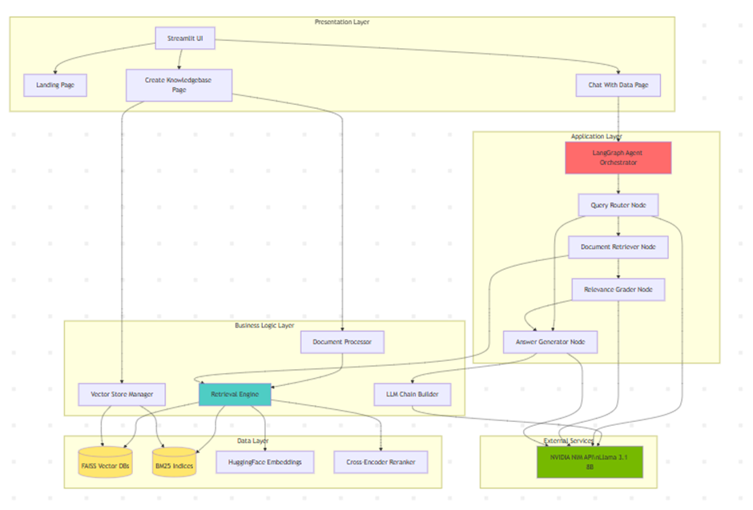
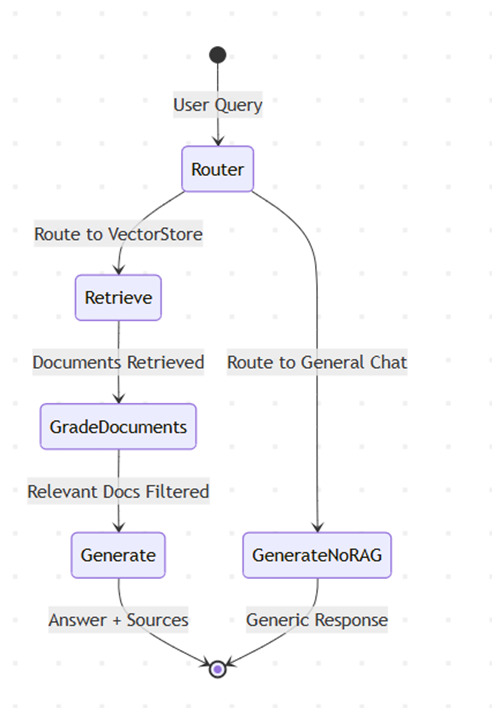
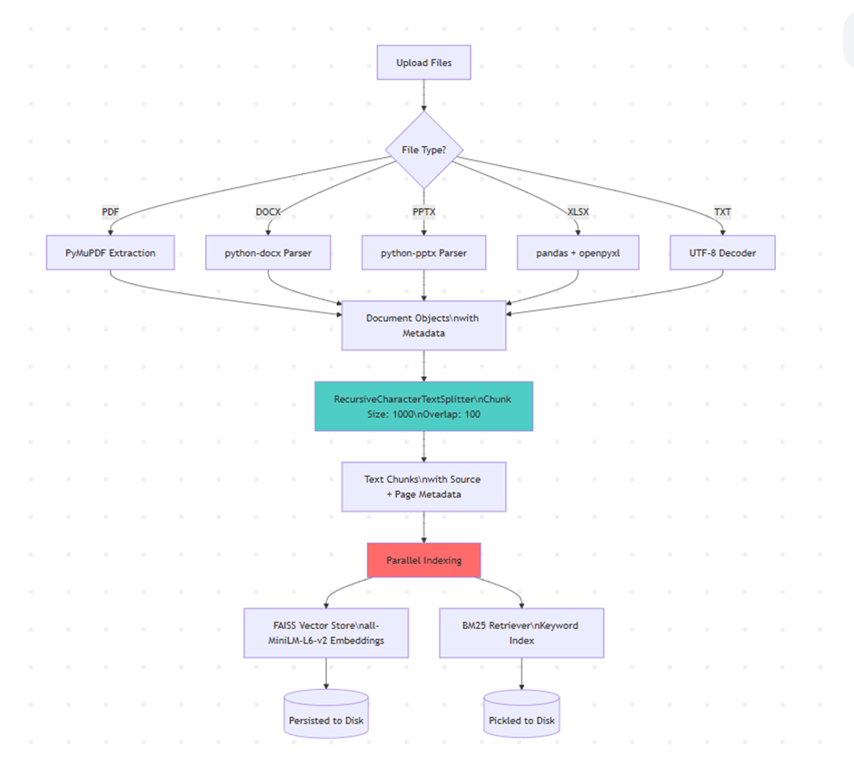

# 🧠 NIMbleRAG

**NIMbleRAG** is a production-grade, **agentic** Retrieval-Augmented Generation (RAG) system designed to be "nimble" yet powerful. It leverages **[NVIDIA NIM](https://build.nvidia.com/)** (NVIDIA Inference Microservices) and **LangGraph** to deliver intelligent, transparent, and accurate AI document interaction.


---

## 🚀 Why NIMbleRAG?

Standard RAG systems often suffer from poor retrieval accuracy or hallucinations. **NIMbleRAG** solves this by implementing an **agentic workflow** with intelligent routing, relevance grading, and transparent reasoning:

1.  **🤖 Agentic Workflow**: Uses LangGraph to orchestrate autonomous agents (Router → Retriever → Grader → Generator)
2.  **🔍 Hybrid Search**: Combines **BM25** (keyword precision) and **FAISS** (semantic understanding) for comprehensive retrieval
3.  **🎯 Cross-Encoder Reranking**: Re-scores retrieved documents using `ms-marco-MiniLM-L6-v2` to eliminate noise
4.  **📊 Transparency**: Every agent decision is logged and visible to users for trust and debugging
5.  **✅ Accuracy**: Multi-stage filtering ensures only highly relevant context reaches the LLM

---

## 🏗️ System Architecture

### High-Level Architecture



The system implements a **4-layer architecture**:

1. **Presentation Layer**: Streamlit multi-page UI (Landing, Create KB, Chat)
2. **Application Layer**: LangGraph agent orchestration with state management
3. **Business Logic Layer**: Document processor, retrieval engine, vector manager
4. **Data Layer**: FAISS vector stores, BM25 indices, local embeddings/reranker

### Agentic Workflow



**LangGraph State Machine**:
- **Router Agent**: Classifies query type (RAG vs. general chat) using LLM
- **Retrieval Agent**: Fetches top-20 documents via hybrid search (BM25 + FAISS)
- **Grader Agent**: LLM evaluates each document for relevance (binary yes/no)
- **Generator Agent**: Produces answer with filtered context and source citations

### Data Ingestion Pipeline



**Multi-format processing**:
- PDF → PyMuPDF extraction
- DOCX/PPTX → python-docx/pptx parsing
- XLSX → pandas conversion
- TXT → UTF-8 decoding

**Dual indexing**:
- FAISS vector store (384-dim embeddings from `all-MiniLM-L6-v2`)
- BM25 keyword index (pickled for persistence)

---

## ✨ Key Features

### 🤖 Agentic Workflow (LangGraph)
-   **Intelligent Routing**: Automatically determines if query needs document retrieval
-   **Relevance Grading**: LLM-based filtering removes irrelevant chunks before generation
-   **Step-by-Step Reasoning**: Transparent agent thoughts displayed in UI
-   **State Management**: Persistent state across nodes for complex workflows

### 🔬 Advanced Retrieval Pipeline
-   **Hybrid Search**: Ensemble of BM25 (sparse) + FAISS (dense) with equal weighting (0.5/0.5)
-   **Cross-Encoder Reranking**: Top-20 → Top-5 reranking using cross-attention scoring
-   **Smart Chunking**: RecursiveCharacterTextSplitter with 1000-char chunks, 100-char overlap
-   **Metadata Preservation**: Source filenames, page numbers, document types retained

### 🧠 Powered by NVIDIA NIM
-   **LLM**: Meta Llama 3.1 8B Instruct via [NVIDIA NIM](https://build.nvidia.com/)
-   **Low Latency**: Enterprise-grade inference with <2s response times
-   **Temperature Control**: 0.0 for routing/grading (deterministic), 0.3 for generation (creative)
-   **Token Efficiency**: Max 1024 tokens per generation for fast responses

### 📂 Multi-Format Document Support
-   **Supported Formats**: PDF, DOCX, PPTX, XLSX, TXT
-   **Intelligent Parsing**: 
    - PyMuPDF for PDFs (handles complex layouts)
    - python-docx/pptx for Office files
    - pandas + openpyxl for Excel sheets
-   **Logging**: Real-time data engineering logs during ingestion

### 🗂️ Multi-Knowledgebase Management
-   **Isolated Databases**: Create separate vector stores for different projects/domains
-   **Easy Switching**: Select and query specific databases via dropdown
-   **Incremental Updates**: Add new documents to existing databases (automatic merging)
-   **Directory Structure**: `vector_dbs/<db_name>/` with FAISS + BM25 indices

---

## 🛠️ Technology Stack

| Component | Technology | Purpose |
|-----------|-----------|---------|
| **LLM** | NVIDIA NIM (Llama 3.1 8B) | Answer generation & agent reasoning |
| **Orchestration** | LangGraph + LangChain | Agentic workflow state management |
| **Vector DB** | FAISS | Dense semantic search (L2 distance) |
| **Sparse Retrieval** | BM25 | Keyword-based search (Okapi BM25) |
| **Embeddings** | all-MiniLM-L6-v2 | Local sentence embeddings (384-dim, 80MB) |
| **Reranker** | ms-marco-MiniLM-L6-v2 | Cross-encoder relevance scoring |
| **UI** | Streamlit | Interactive multi-page web interface |
| **PDF Parsing** | PyMuPDF (fitz) | Fast, accurate PDF text extraction |
| **Evaluation** | Ragas | RAG-specific quality metrics |

---

## 🚀 Setup & Installation

### Option 1: Local Development

1.  **Clone the repository**:
    ```bash
    git clone <repository-url>
    cd NVIDIA-NIM-PDF-RAG
    ```

2.  **Create a Virtual Environment**:
    ```bash
    python -m venv venv
    # Windows
    venv\Scripts\activate
    # Linux/Mac
    source venv/bin/activate
    ```

3.  **Install Dependencies**:
    ```bash
    pip install -r requirements.txt
    ```

4.  **Configure Environment**:
    Create a `.env` file in the root directory and add your API key from [build.nvidia.com](https://build.nvidia.com/):
    ```env
    NVIDIA_API_KEY=your_api_key_here
    ```

5.  **Run the Application**:
    ```bash
    streamlit run app.py
    ```
    Access at `http://localhost:8501`

### Option 2: Docker Deployment

1.  **Build the Image**:
    ```bash
    docker build -t nimblerag .
    ```

2.  **Run the Container**:
    ```bash
    docker run -p 8501:8501 --env-file .env nimblerag
    ```
    Access the app at `http://localhost:8501`

---

## 📚 How to Use

### Step 1: Create a Knowledgebase 📂

1. Navigate to **"Creating Knowledgebase"** page in the sidebar
2. Enter a database name (e.g., `Research_Papers_2024`)
3. Upload your documents (PDF, DOCX, PPTX, XLSX, TXT)
4. Click **"Process & Create/Update"**
5. Watch the data engineering pipeline:
   - Document parsing and text extraction
   - Chunking with overlap for context preservation
   - Dual indexing (FAISS vectors + BM25 keywords)

### Step 2: Chat With Your Data 💬

1. Switch to **"Chat With Data"** page
2. Select your target knowledgebase from the dropdown
3. Ask questions in natural language
4. View the **agent's reasoning trace**:
   - Query routing decision
   - Number of documents retrieved
   - Relevance grading results
   - Final answer generation
5. Explore **source citations** with page numbers for verification

---

## 📂 Project Structure

```text
NVIDIA-NIM-PDF-RAG/
├── app.py                          # Main Landing Page & Navigation
├── pages/
│   ├── 1_Creating_Knowledgebase.py # Admin: Ingest & Index Documents
│   └── 2_Chat_With_Data.py         # Chat: Select DB & Query with Agent
├── src/
│   ├── config.py                   # Centralized Configuration
│   ├── document_processor.py       # Multi-Format Parsing & Chunking
│   ├── retrieval_engine.py         # Hybrid Search & Reranking
│   ├── agent_graph.py              # LangGraph Agentic Workflow
│   ├── vector_manager.py           # Multi-DB Directory Management
│   ├── llm_chain.py                # LangChain Pipeline Builder
│   ├── evaluation.py               # Ragas Evaluation Script
│   └── utils.py                    # Helper Functions
├── vector_dbs/                     # Storage for Vector Indices
├── system_design_img/              # Architecture Diagrams
├── SYSTEM_DESIGN_DOCUMENT.md       # Detailed System Design
├── requirements.txt                # Python Dependencies
├── Dockerfile                      # Docker Configuration
└── .env                            # Environment Variables (API Keys)
```

---

## 🎯 Key Design Decisions

1. **Agentic Workflow over Simple Chain**: Provides transparency, flexibility, and quality filtering
2. **Hybrid Search**: Balances keyword precision (BM25) with semantic understanding (FAISS)
3. **Local Embeddings**: Zero cost, privacy-preserving, offline-capable
4. **Multi-Knowledgebase**: Isolated contexts prevent cross-contamination
5. **Cross-Encoder Reranking**: Improves precision at acceptable latency cost (~50ms)


---

## 🙏 Acknowledgments

- **NVIDIA** for NIM API and Llama 3.1 model access
- **LangChain/LangGraph** for RAG orchestration framework
- **Sentence Transformers** for embedding models
- **Facebook AI** for FAISS vector search
- **Streamlit** for rapid UI development

---